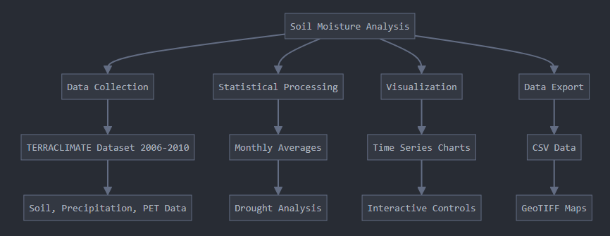
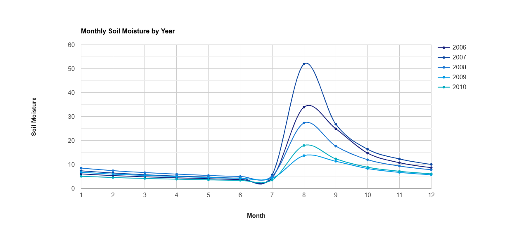
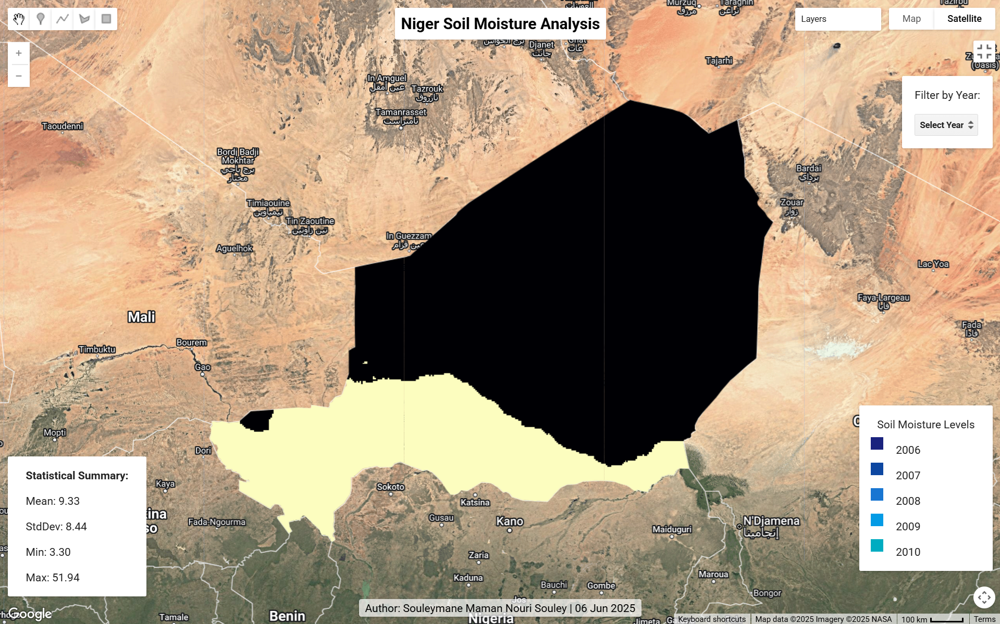
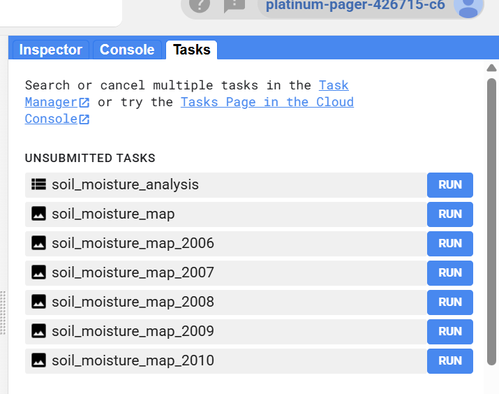

# Soil_Moisture_Analysis (Analysi de l'humidité du sol)

Advanced Earth Engine script for analyzing soil moisture patterns using TERRACLIMATE data (2006-2010). (Modèle avancé de script Earth Engine pour analyser les modèles d'humidité du sol en utilisant les données TERRACLIMATE (2006-2010).)

## Features (Fonctionnalités)

- Monthly soil moisture analysis (Analyse mensuelle de l'humidité du sol).
- Drought detection system (Système de détection de sécheresse).
- Interactive visualization (Visualisation interactive).
- Statistical summaries (Sommaires statistiques).
- Multi-band correlation analysis (Analyse de corrélation multi-bandes).
- Data export capabilities (Exportation de données).

## Data Sources (Sources de données)
- Dataset: IDAHO_EPSCOR/TERRACLIMATE (Base de données: IDAHO_EPSCOR/TERRACLIMATE)
- Parameters: Soil Moisture, Precipitation, PET (Evapotranspiration potentielle), Temperature (Paramètres: Humidité du sol, Précipitations, PET (Évapotranspiration potentielle), Température)
- Resolution: 11km (11 km de résolution)
- Temporal Range: 2006-2010 (Période temporelle: 2006-2010)

## Methodology (Méthodologie)

# Outputs (Sorties)
* Time series charts (Graphiques de séries temporelles)
* Statistical summaries (Sommaires statistiques)
* Drought alerts (Alertes de sécheresse)
* CSV data exports (Exportations de données CSV)
* GeoTIFF maps (Cartes GeoTIFF)

# Installation

* Clone repository (Cloner le dépôt)
* Upload script to Google Earth Engine (Télécharger le script sur Google Earth Engine)
* Define study area ('table' asset) (Définir la zone d'étude ('table' asset))
* Run analysis (Exécuter l'analyse)

# Requirements (Exigences)

* Google Earth Engine account (Compte Google Earth Engine)
* Study area geometry ('table' asset) (Zonage de l'étude ('table' asset))

# License (Licence)
* MIT